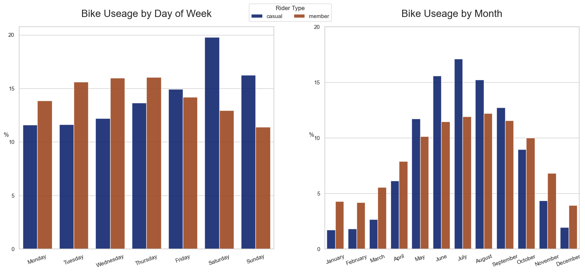
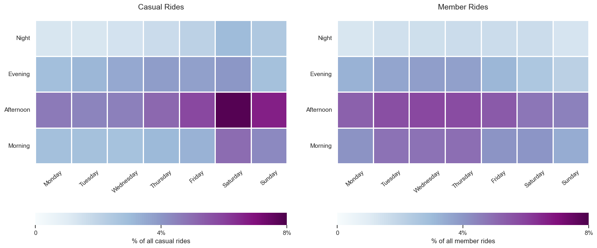
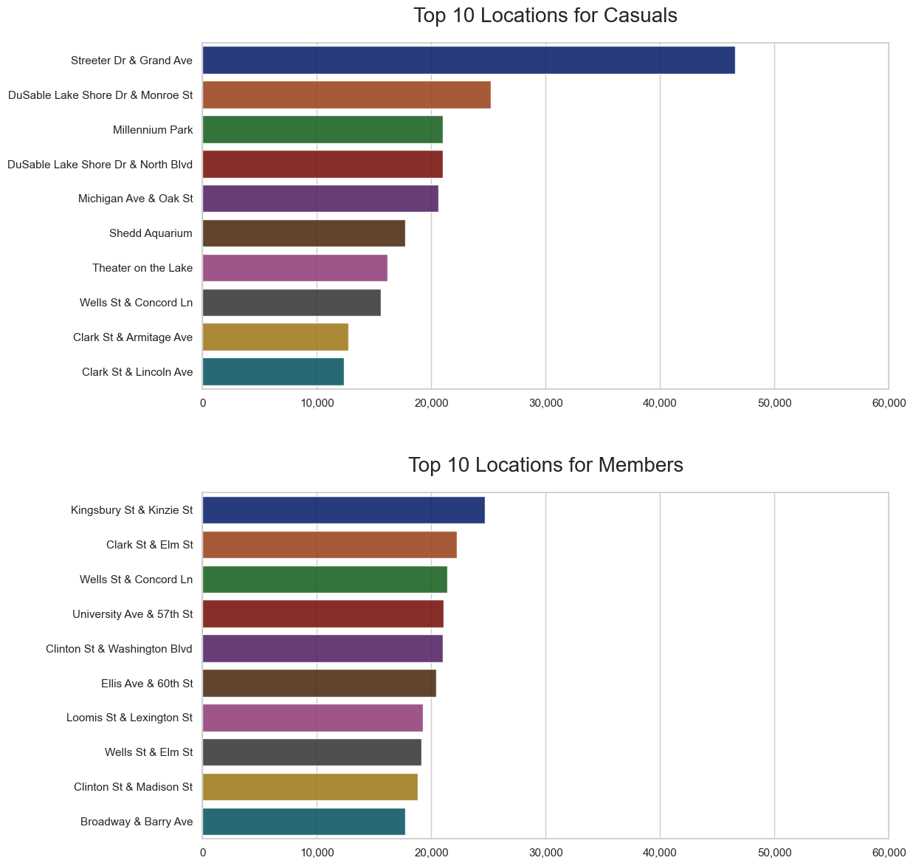
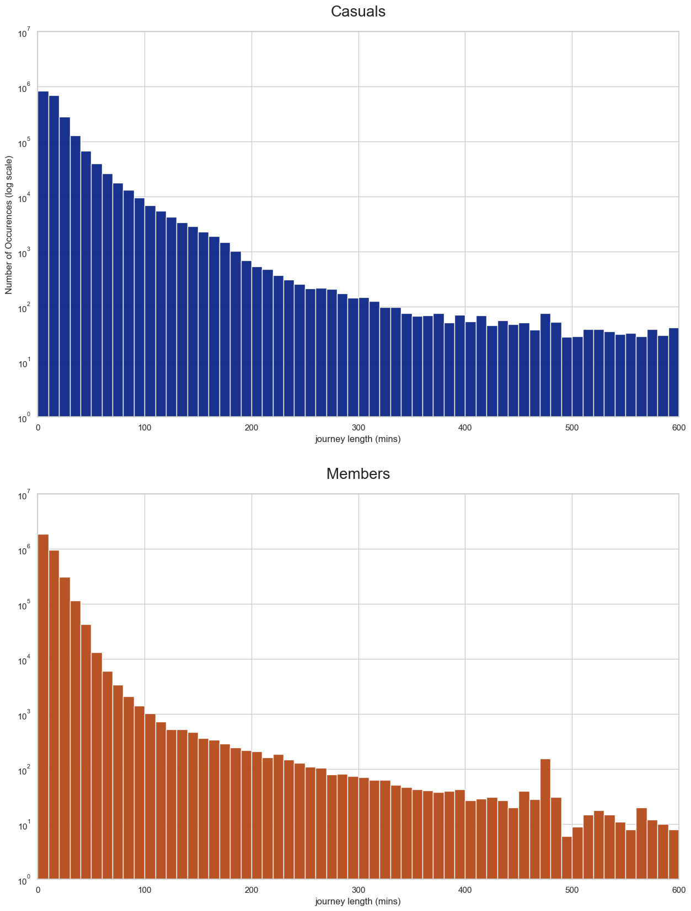
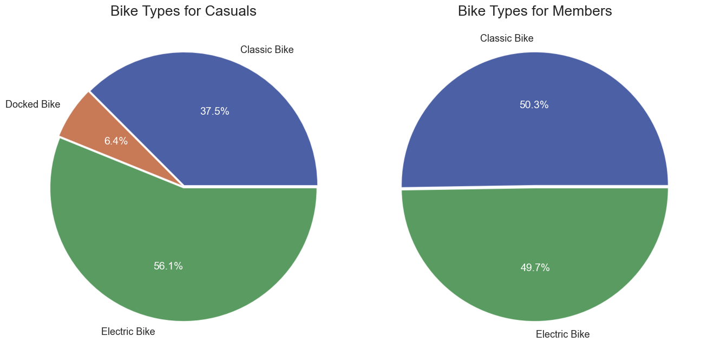

# Table of Contents
- [Table of Contents](#table-of-contents)
- [Background](#background)
- [Report](#report)
  - [Executive Summary](#executive-summary)
- [About the Data](#about-the-data)
  - [Source](#source)
  - [Assumptions](#assumptions)
  - [Limitations](#limitations)
  - [Hypothesis](#hypothesis)
- [Bike Usage - When](#bike-usage---when)
  - [Days of Week](#days-of-week)
  - [Months](#months)
  - [Time of Day \& Days of Week](#time-of-day--days-of-week)
- [Bike Usage - Where](#bike-usage---where)
- [Bike Usage - Journey Lengths](#bike-usage---journey-lengths)
- [Bike Usage - Bike Types](#bike-usage---bike-types)
- [Key Findings](#key-findings)
- [Top 3 Reccommendations based on findings](#top-3-reccommendations-based-on-findings)

# Background
Cyclistic is a bike-sharing company within the fictional case study that can be viewed [here](case_study.pdf)

# Report

## Executive Summary

Cyclistic currently offers single ride passes, full day passes and annual memberships. **Casual Riders** are those that use single-ride or full-day passes. **Member Riders** are those that purchase annual memberships. 

Cyclystic’s marketing strategy has so far relied on building general awareness of its products. It has recently been concluded that annual members are much more profitable than casual riders and it is believed that maximizing the annual members will be the key to future growth. Hence, the current goal of the marketing team is to design a marketing strategy to convert casual riders into annual members.

One of the questions that the marketing team is interested in is **“How do annual members and casual riders use Cyclistic bikes differently?”**, which will be the main point of the analysis.

# About the Data
## Source
All data is primary data and directly from Cyclystic’s historical trips within the last 12 months. The 12 months altogether contain around 6 million observations.
## Assumptions
The dataset contained starting and ending journey times, from which journey lengths were calculated. Negative journey lengths and those of over 10 hours were dropped. The former is impossible, and the latter is highly improbable to be real rides; much more likely to be forgetting to place the bike back at a station.

Another key assumption is that observations with the exact same start and end GPS are not genuine rides and were dropped. Due to GPS precision, if starting and ending location is the same down to the centimeter, its much more likely to be the case of a bike’s system registering as turning on and remaining as stationary, than a genuine ride.

## Limitations
There is no information regarding about the types of people who use the bikes apart from their membership’s status. This makes it more difficult to extrapolate reasons driving membership status such as financial status.

There is also no information regarding journey paths, only starting and ending station locations and times. This makes it very difficult to differentiate genuine use of bikes and bikes that were taken out by accident or not placed back properly. Evidence pointing to some observations not being genuine rides include journeys that are well over 24 hours.

## Hypothesis
Current casual riders are more likely to ride bikes for leisure and current member riders are more like to use for commuting.

# Bike Usage - When

## Days of Week
The number of casual members that ride steadily increases from Monday and peaks at the weekend. On the other hand, the number of member riders follows a much more uniform distribution with mid-week peaks and weekend drops.

This adds some evidence towards the hypothesis that casual riders are more likely to use the rides for leisure, which is what we see with the weekend peaks.

## Months
The number of both types of riders increase during the warmer months and tapers off during the colder months. An interesting observation is that the peaks for casual rider’s peaks stronger during the summer months and falls stronger during the winter months.

The number of member riders by month fluctuates less than casual riders, which suggests more members than casuals are willing to ride during harsh conditions.

## Time of Day & Days of Week

There is a strong correlation between afternoon rides across all days of week for both types of riders. However, casual rides steadily increase as the weekend approaches, whereas the opposite is true for member rides.

Since midweek afternoon rides are most likely to be commutes back from work, this adds evidence towards the hypothesis of member rides using the bikes as a mode of transport to and from work.

# Bike Usage - Where

Many top 10 locations for casuals are either by the seafronts, piers, or open plan locations such as Millennium Park. On the other hand, the top 10 locations for members are within residential areas or central Chicago. 

# Bike Usage - Journey Lengths

Please note the log scale. The graphs tell us that members are more likely than casuals to have short journeys, and that casuals are more likely than members to have longer journeys.

Depending on the number of bikes available, this may partly be a driver for the difference in profitability between the casuals and members. Since more casuals engage in longer journeys than members, there may be a lack of bikes for other people when casuals go on long journeys.

# Bike Usage - Bike Types

Usage of classic bikes and electric bikes is split 50/50 for annual members. On the other hand, there is a strong preference for electric bikes for the casuals. 

The reason behind this needs to be further investigated. If it is due to individual preferences rather than availability, than this may be an avenue for a marketing strategy.

# Key Findings
* Casuals prefer weekends whereas Members prefer weekdays.
* Both prefer afternoons – although the reason behind this may be different.
* The number of bike users steadily increases as the seasons turn warmer and drops in the harsh winter months, but the difference between peak and lowest is much greater for casuals.
* There is evidence to suggest that casuals may prefer electric bikes to classic bikes.
* There is evidence to suggest that casuals use the bikes for leisure whereas the members use them for commuting.
* There is evidence to suggest that casuals use the bikes for longer on average.

# Top 3 Reccommendations based on findings
1) Offer attractive prices for the annual memberships during the summer months. This is when the number of casuals riding the bikes peaks.
2) Offer alternative “annual weekend” passes, which allow members of these passes to ride on weekends.
3) Limit the amount of time that casuals can ride passed a certain amount of time without occurring additional fees, but do not apply this limit for members. This can make annual membership more attractive to those who want to ride.
